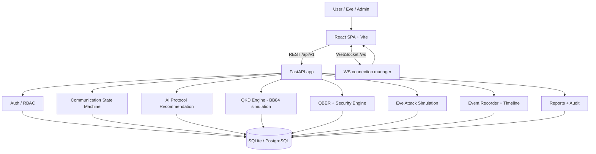

# QuantumSecure

**A dynamic quantum-secure communication platform: QKD simulation, QBER-based security evaluation, AI-assisted protocol selection, and Eve/attacker simulation with a real React + FastAPI + WebSocket architecture.**

QuantumSecure is a full-stack **software simulation** of a Quantum Secure Communication (QSC) platform. It demonstrates how the *logic* of quantum key distribution (QKD) can be simulated in software to protect message exchanges, how a **quantum bit error rate (QBER)** decides whether a derived key is trustworthy, how an AI scoring engine selects the best QKD protocol, and how a simulated attacker ("Eve") can probe a live channel — and get caught.

> **Important scope note:** all "quantum" behaviour in QuantumSecure is a *classical Monte-Carlo simulation* of measurement statistics. There is **no physical quantum hardware, no QKD hardware, and no real quantum entanglement** involved. QBER values and the `0.11` threshold are simulation thresholds. This is an educational / research platform that demonstrates the *system logic* of key reconciliation, error estimation, protocol selection, attack detection and real-time security telemetry.
---

## Table of Contents

1. [Project Overview](#project-overview)
2. [Problem Statement](#problem-statement)
3. [Project Objectives](#project-objectives)
4. [Key Features](#key-features)
5. [System Architecture](#system-architecture)
6. [Complete Application Workflow](#complete-application-workflow)
7. [Quantum Communication & QKD Workflow](#quantum-communication--qkd-workflow)
8. [Supported QKD Protocols](#supported-qkd-protocols)
9. [AI Protocol Recommendation](#ai-protocol-recommendation)
10. [QBER and Security Evaluation](#qber-and-security-evaluation)
11. [Eve / Attacker Simulation](#eve--attacker-simulation)
12. [Attack Detection and Response](#attack-detection-and-response)
13. [Real-Time WebSocket Architecture](#real-time-websocket-architecture)
14. [Communication State Machine](#communication-state-machine)
15. [Frontend Architecture](#frontend-architecture)
16. [Backend Architecture](#backend-architecture)
17. [Database Architecture](#database-architecture)
18. [Authentication and Authorization](#authentication-and-authorization)
19. [API Overview](#api-overview)
20. [WebSocket Events](#websocket-events)
21. [Frontend Pages](#frontend-pages)
22. [Backend Services](#backend-services)
23. [Security Model](#security-model)
24. [Project Folder Structure](#project-folder-structure)
25. [Technology Stack](#technology-stack)
26. [Installation](#installation)
27. [Environment Configuration](#environment-configuration)
28. [Database Setup](#database-setup)
29. [Running the Backend](#running-the-backend)
30. [Running the Frontend](#running-the-frontend)
31. [Complete Local Development Setup](#complete-local-development-setup)
32. [Testing](#testing)
33. [Test Coverage / Current Test Status](#test-coverage--current-test-status)
34. [Integration Verification](#integration-verification)
35. [Example End-to-End Scenarios](#example-end-to-end-scenarios)
36. [Error Handling](#error-handling)
37. [Configuration Notes](#configuration-notes)
38. [Development Guidelines](#development-guidelines)
39. [Current Implementation Status](#current-implementation-status)
40. [Future Enhancements](#future-enhancements)
41. [Limitations](#limitations)
42. [Important Security Disclaimer](#important-security-disclaimer)
43. [License](#license)
---

## Project Overview

**What it is.** QuantumSecure connects a React + TypeScript frontend (Track A) to a FastAPI backend (Track B) implementing a simulated QKD secure-communication pipeline. A user sends a message to another user's unique QSC ID; the backend selects and executes a QKD protocol, derives a cryptographic key, encrypts the message, and either delivers it or blocks it — broadcasting live state changes over WebSockets and persisting a replayable timeline.

**Why it is simulated.** Real quantum-secure infrastructure is experimental and unsuitable for a course project. Simulating the *logic* of QKD, QBER-based decisions and eavesdropping demonstrates the full engineering problem: state machines, cryptography, real-time systems, RBAC.

**How QKD is used.** `QkdService` orchestrates runs; `app/protocols/bb84.py` executes a classical Monte-Carlo simulation: Alice random bits + bases (Z/X), Bob random bases, matching bases sift into a key candidate, channel noise and Eve inject errors that become QBER events.

**How classical and quantum parts interact.** Classical channels carry the encrypted message (AES-256-GCM); the quantum simulation decides *whether* the session may proceed — only an accepted key enables encryption and delivery.

**How QBER determines security.** QBER = errors / compared_bits, computed only by the QBER engine. Threshold defaults to `0.11`. QBER <= threshold -> key ACCEPTED; QBER > threshold -> key REJECTED and message BLOCKED. Admins retune via `PATCH /api/v1/admin/config`.

**How AI assists protocol selection.** `AiRecommendationService` scores every registered protocol against a feature snapshot with admin-editable weights. The top-scoring enabled-and-supported protocol is executed — by invariant, the executed protocol equals the recommended protocol.

**How Eve attacks are simulated.** ATTACKER accounts act inside the attack window. Eve launches an intercept-and-resend attack at 10-100% strength; the backend deterministically reruns the stored baseline with Eve injected, recomputes QBER and records the attack row.

**How the system reacts to attacks.** A post-attack QBER above the threshold rejects the key, flips the session to BLOCKED, withholds delivery, writes a security report and audit rows, and emits attack.detected and message.blocked events to every role.

**How the frontend receives live events.** `RealtimeService` fans domain events into per-role / per-communication WebSocket channels. React subscribes with a JWT handshake, pushes toasts, and invalidates matching TanStack query caches so open views refresh instantly; REST timeline replay restores history after a reconnect.

**How the backend controls the state.** `StateMachineService` is the only component allowed to change session_status. Transitions are validated against the legal-transition table, persisted to communication_events, and broadcast. REST is the source of truth; WebSocket is the live view.
---

## Problem Statement

Classical public-key cryptography is computationally breakable in principle (e.g., by large-scale quantum computers), and genuinely secure quantum channels are not available in a lab or classroom. There is a gap: how can a software team build, test and *demonstrate* a quantum-aware secure-communication workflow — key agreement, error estimation, threshold-based trust decisions, eavesdropping detection, and live security telemetry — without quantum hardware? QuantumSecure fills that gap with a faithful, reproducible simulation.
---

## Project Objectives

- Model a complete QKD-style secure messaging pipeline in software: message creation -> protocol selection -> key simulation -> security evaluation -> encryption -> delivery or blocking.
- Deliver a real frontend-backend architecture (React SPA vs FastAPI REST vs WebSocket) with no client-side security decisions.
- Implement the BB84 protocol as an actual, runnable simulation with seeded, reproducible randomness.
- Implement QBER-based key acceptance/rejection against a configurable simulation threshold.
- Implement AI-assisted protocol recommendation whose output equals the executed protocol (hard invariant).
- Model an attacker (Eve) with an intercept-and-resend attack, a live attack window, and detection logic.
- Provide real-time event streaming (WebSocket channels per role), a replayable timeline, audit trails, and admin analytics.
- Ship a test suite covering state-machine legality, protocol vectors, QBER math, attack flows, WebSocket gating, auth, and end-to-end scenarios.
---

## Key Features

All features below were verified against the source code.

| Feature | Where it lives | Notes |
|---|---|---|
| Registration / login / refresh / logout | `routers/auth.py`, `services/auth_service.py` | bcrypt hashes, JWT access + rotating refresh tokens |
| Unique QSC identity | `services/qsc_id_service.py` | Format `QSC-[A-Z0-9]{10}`, issued at registration |
| Role-based access (USER / ATTACKER / ADMIN) | `core/dependencies.py` | `require_roles`, fail-closed |
| Secure message send with QKD pipeline | `services/messaging_service.py` | optional async background pipeline |
| QKD simulation (BB84) | `app/protocols/bb84.py` | seeded classical Monte-Carlo |
| AI protocol recommendation | `services/ai_recommendation_service.py` | weighted scoring + softmax confidence |
| QBER calculation | `services/qber_engine.py` | single source of truth; zero-denominator guard |
| Security evaluation, key accept/reject | `services/security_engine.py` | QBER vs threshold; downgrade gate |
| Eve attack simulation (intercept-and-resend) | `services/attack_simulation_service.py` | deterministic rerun with Eve injected |
| Attack detection and message blocking | `security_engine.py`, `attack_simulation_service.py` | recomputed QBER above threshold |
| Real-time WebSocket events | `app/ws/*`, `services/realtime_service.py` | user / eve / admin / comm channels |
| Communication timeline (REST replay) | `routers/communications.py` (`GET /{id}/timeline`) | 500-cap persisted events |
| QKD transcript sample (never key bits) | `services/qkd_service.py` | visualization only |
| Security reports | `services/reporting_service.py`, `routers/reports.py` | per-message + list |
| Audit trail | `services/audit_service.py`, `routers/admin.py` | redacted, paginated |
| Admin dashboard, attacker CRUD, config | `routers/admin.py` | threshold updates audited |
| Protocol analytics / security events feed | `routers/admin.py` | live DB aggregates |
| REST API with auto OpenAPI docs | `docs/openapi.json` | 39 paths; Swagger at `/docs` |
| Database persistence | SQLAlchemy + Alembic (SQLite/PostgreSQL) | 5 migrations |
---

## System Architecture



Layers: (1) Frontend — React 19 + TypeScript + Vite, TanStack Query, Zustand, Axios, WebSocket client. (2) API — FastAPI routers under `/api/v1`, global error envelope, CORS, security headers, rate limiting, request IDs. (3) Services — the secure pipeline: state machine, AI recommendation, QKD, QBER, security engine, attack simulation, encryption, delivery, reporting, audit, realtime. (4) Data — SQLAlchemy 2.x + Alembic; SQLite for dev/test, PostgreSQL-ready. (5) Realtime — `RealtimeService` + WS manager (JWT handshake, channel routing); the same events are persisted for REST replay.
---

## Complete Application Workflow

1. User signs in via `POST /api/v1/auth/login` -> access + refresh JWTs; the role determines the UI zone.
2. Sender finds the receiver → `GET /users/search?qsc_id=` and copies the receiver's QSC ID.
3. Sender composes → `POST /api/v1/messages` with `{receiver_qsc_id, content, security_requirement}`.
4. Backend creates the session (state `CREATED`) and transitions to `RECEIVER_VERIFIED`; emits `communication.created`.
5. Pipeline on the backend: `AI_ANALYZING` -> recommendation -> `PROTOCOL_SELECTED` -> `QKD_INITIALIZING` -> `QKD_RUNNING` (progress ticks) -> `KEY_SIFTING` -> `QBER_EVALUATION` -> `SECURITY_CHECK`.
6. Security decision: accepted -> key stored (encrypted at rest) -> `ENCRYPTING` -> `ENCRYPTED` -> `DELIVERED` -> receiver marks `READ`. Rejected -> `ATTACK_DETECTED` -> `KEY_REJECTED` -> `BLOCKED`.
7. A security report and audit rows are written on both paths.
8. Attacker window: while the session is in `QKD_INITIALIZING`..`SECURITY_CHECK`, Eve may launch an attack; if detected, the running session flips to `BLOCKED`.
9. Every step broadcasts a WS event and appends a timeline entry; the UI subscribes and updates live.
---

## Quantum Communication & QKD Workflow

`QkdService` orchestrates runs; `app/protocols/bb84.py` executes the simulation.

1. **Seed** — `seed = |hash((communication_id, run_count, "qsc-qkd-seed"))| mod 2^48`, so reruns are reproducible.
2. **Streams** — `StreamProvider(seed)` derives independent named RNG streams (`alice_bits`, `alice_bases`, `channel_noise`, `bob_bases`, `bob_measure`, plus attacker streams `eve_pick`, `eve_basis`, `eve_outcome`). Injecting Eve never perturbs the Alice/Bob/noise streams.
3. **Alice** — generates `n = 256` random bits and Z/X bases.
4. **Channel noise** — each transmitted bit flips with probability `channel_noise` (default `0.01`).
5. **Eve (attack reruns only)** — picks `round(p·n)` target indices, measures each state in a random basis, resends her outcome (intercept-and-resend).
6. **Bob** — basis match -> deterministic outcome; mismatch -> random 50/50.
7. **Sifting** — indices where Alice and Bob bases match are kept (`sifted_key_bits` = Alice's bits; never serialized).
8. **Error estimation** — a sample of the sifted bits is compared; `errors` and `compared_bits` are counted.
9. **QBER** — `errors / compared_bits`, rounded to 6 decimals.
10. **Persistence** — a `QkdSession` row stores metadata only (no key bits); `sample_json` stores the first 32 rounds' public basis/metadata for visualization.
---

## Supported QKD Protocols

`backend/app/protocols/base.py` defines `ProtocolBase` + a `ProtocolRegistry`. The default registry registers six protocols and **all six are implemented and runnable** (seeded Monte-Carlo simulations in `bb84.py` + `stubs.py`): **BB84, B92, E91, SIX_STATE, SARG04, DECOY_BB84**. All are enabled in `protocol_configs` (migration `0003_enable_all_protocols`) and eligible for AI recommendation and manual selection.

### BB84 (implemented)

| Aspect | Behaviour |
|---|---|
| Purpose | Simulated BB84 key-distribution protocol |
| Key material | Alice's random bits; the sifted bitstring becomes key material (HKDF-derived to 32 bytes in `KeyService`) |
| Bases / states | Two bases, rectilinear `Z` and diagonal `X`; one basis chosen per qubit |
| Measurement simulation | Bob measures a qubit: basis match -> exact outcome; mismatch -> random (50/50) |
| Key sifting | Keep the qubits whose Alice and Bob bases match; those bits form the sifted key |
| QBER calculation | `errors / compared_bits` over the compared subset |
| Security evaluation | `QBER <= threshold` -> ACCEPTED; else REJECTED |
| Under Eve attack | A random `round(strength·n)` subset is intercepted, measured, re-sent in a random basis, raising the measured error count and QBER |

### All protocols implemented (BB84 + B92/E91/SIX_STATE/SARG04/DECOY_BB84)

All six protocols share the same seeded simulation engine and support Eve intercept-and-resend. **B92** (2 non-orthogonal states), **E91** (entanglement-based, Bell states), **SIX_STATE** (3 bases Z/X/Y), **SARG04** (BB84 variant resistant to photon-number-splitting), **DECOY_BB84** (multi-intensity decoy states). See `backend/app/protocols/stubs.py` for the per-protocol state/sifting logic.
---

## AI Protocol Recommendation

- **Inputs** — a feature snapshot from live data and settings: `channel_noise`, `security_requirement` (LOW/MEDIUM/HIGH -> 0.2/0.5/0.9), `estimated_attack_risk` (recently detected attacks in the previous 24 h), `distance_km` (simulated per security level), `qubits_requested`.
- **Scoring** — `AiRecommendationService.score_protocols()` combines per-protocol capabilities (noise resistance, key efficiency, max distance, maturity) with feature-derived fits, weighted by `DEFAULT_WEIGHTS` (overridable via `protocol_configs.parameters.feature_weights` for BB84).
- **Eligibility** — only enabled *and* supported protocols compete (`_is_eligible`); unsupported stubs are filtered out before scoring.
- **Selection** — the top scorer wins; confidence is a softmax margin over the top two scores; an explanation is generated.
- **Execution** — the recommended protocol string is written to `CommunicationSession.protocol` and is exactly what `QkdService` executes (hard invariant: recommendation == execution).
- **Persistence** — every recommendation stores `features`, `protocol_scores`, `confidence`, `explanation` in `ai_recommendations`, replayable via `GET /communications/{id}/recommendation`.
---

## QBER and Security Evaluation

- `compute_qber(errors, compared_bits)` raises on a zero denominator and range-checks inputs; returns `round(errors / compared_bits, 6)`. Owned solely by `QberEngine`.
- `SecurityEngine.evaluate(qber, threshold)` -> `ACCEPTED` iff `qber <= threshold`, else `REJECTED`.
- `evaluate_session` runs `SECURITY_CHECK`, persists the verdict on the run row, and drives the state machine (`KEY_ACCEPTED` or `ATTACK_DETECTED -> KEY_REJECTED -> BLOCKED`).
- `confirm_key_accepted` gates encryption: the latest run must be `ACCEPTED` and the session must not be on a rejected/blocked path.
- A decision cannot be downgraded after `DELIVERED`; it is only mutable while inside the attack window (`QKD_INITIALIZING` .. `SECURITY_CHECK`).
- The same single-threshold rule is reused for post-attack detection (`evaluate_post_attack`).
---

## Eve / Attacker Simulation

The attacker model is intercept-and-resend only in v1 (`ATTACK_TYPES = ("INTERCEPT_AND_RESEND",)`).

| Aspect | Behaviour |
|---|---|
| Eve role | ATTACKER accounts (admin-created via admin UI/API; also bootstrappable as `eve@qsc.dev`) |
| Attack window | Only sessions in `QKD_INITIALIZING`, `QKD_RUNNING`, `KEY_SIFTING`, `QBER_EVALUATION` or `SECURITY_CHECK` are attackable (`ATTACK_WINDOW_STATES`) |
| Configuration | `POST /communications/{id}/attacks` with `attack_type` + `attack_strength` (0.1-1.0); capped at `MAX_REATTACKS` (3) |
| Interception | Deterministic rerun of the stored baseline with `eve_fraction == strength`; `round(strength*n)` become `eve_touched` |
| Resend | Eve measures each intercepted state in a random basis and re-sends her measured outcome |
| QBER impact | Post-attack run recomputes counters; `qber_before` vs `qber_after` stored on the `attacks` row |
| Detection status | `DETECTED` if `qber_after > threshold`, else `NOT_DETECTED` |
| Session state | DETECTED -> `ATTACK_DETECTED -> KEY_REJECTED -> BLOCKED`; NOT_DETECTED -> session resumes normal flow |
| Response | DETECTED: message flagged `attack_detected`, `message.blocked` emitted, `BLOCKED` terminal |
| Delivery / blocking | Blocked messages never appear in the inbox (inbox only returns DELIVERED/READ); sender sees the BLOCKED flag in Sent |
| History & stats | `GET /attacks/history` (own), `GET /attacks/summary` and `/eve/dashboard/summary` (totals, detection rate) |
| Target list | `GET /communications/active` returns metadata-only rows (communication id, sender/receiver id+name, protocol, state, latest-run QBER, attackability) for USER→USER sessions inside the window; the requesting attacker's own sessions are excluded; the EVE dashboard refreshes it live from `communication.state_changed` — no manual reload (requires `PROCESS_ASYNC=true`, the `.env.example` default) |

`AttackSimulationService` is the only component allowed to launch attacks; session-state transitions remain exclusive to `StateMachineService`.
---

## Attack Detection and Response

1. Eve posts an attack while the session is inside the attack window.
2. `append_post_attack_run` reruns the same seed with Eve injected and appends a new `qkd_sessions` row (`is_baseline=False`).
3. `SecurityEngine.evaluate_post_attack` applies the single rule: `qber_after > threshold` -> **DETECTED**.
4. DETECTED path emits `qber.calculated`, `attack.detected`, and `message.blocked`; the state machine drives `ATTACK_DETECTED -> KEY_REJECTED -> BLOCKED`; the message is flagged and a security report is written.
5. NOT_DETECTED path broadcasts `attack.progress` at 100% and leaves the session to continue normally.
---

## Real-Time WebSocket Architecture

Frontend `WsProvider`/`WsClient` -> JWT handshake `?token=<access_token>` -> role + ownership checks (closes 4401/4403/4404) -> `RealtimeService` (per-channel asyncio queues) -> services call `realtime_service.emit` only *after* the domain change. The same events are persisted to `communication_events` for REST replay. Server pings `{"action":"ping"}` every 30 s; clients reply `{"action":"pong"}`; auto-reconnect with exponential backoff (1 s -> 30 s, with jitter) plus a frame watchdog. Envelope: `{type, communication_id, state, actor_role, payload, timestamp}`.

**Channels**

| Endpoint | Allowed roles | Content |
|---|---|---|
| `/ws/user/events` | USER, ADMIN | user-scope events |
| `/ws/eve/events` | ATTACKER | eve-scope events (windows, attacks) |
| `/ws/admin/events` | ADMIN | admin-scope events |
| `/ws/communications/{id}` | sender, receiver, ADMIN | per-session event stream |

### REST Timeline Replay

`GET /api/v1/communications/{id}/timeline` returns up to 500 persisted events (type, state, previous_state, timestamp). The frontend uses it to bootstrap the timeline panel and resync after a disconnect — WS tickles live views while REST stays authoritative.
---

## Communication State Machine

Defined in `backend/app/services/state_machine.py`. `STATES` is the fixed vocabulary; `LEGAL_TRANSITIONS` is the only transition table; `DERIVED_STATUS` maps each session state to `(message.status, key_status)` for API responses.

```text
CREATED --> RECEIVER_VERIFIED --> AI_ANALYZING --> PROTOCOL_SELECTED
  --> QKD_INITIALIZING --> QKD_RUNNING --> KEY_SIFTING
  --> QBER_EVALUATION --> SECURITY_CHECK --> KEY_ACCEPTED --> ENCRYPTING
  --> ENCRYPTED --> DELIVERED --> READ                       (terminal)
SECURITY_CHECK --> ATTACK_DETECTED --> KEY_REJECTED --> BLOCKED  (terminal)
any internal failure --> FAILED                                   (terminal)
```

- `ATTACK_WINDOW_STATES` = `{QKD_INITIALIZING, QKD_RUNNING, KEY_SIFTING, QBER_EVALUATION, SECURITY_CHECK}`.
- `MAX_REATTACKS = 3`; `TERMINAL_STATES = {READ, BLOCKED, FAILED}`.
- Every transition updates derived message fields, persists a timeline entry, and broadcasts `communication.state_changed` (plus the `eve` channel while inside the attack window).
- `QKD_RUNNING --> QKD_RUNNING` is a deliberate self-loop modelling progress ticks.
---

## Frontend Architecture

- **Framework**: React 19 + TypeScript, built with Vite 8; Tailwind CSS; Recharts for analytics.
- **Routing**: `react-router-dom` with three role zones (USER / ATTACKER / ADMIN) behind `<RequireAuth roles>`.
- **Server state**: TanStack Query hooks (`src/queries/hooks.ts`) + a WS->invalidation map (`src/queries/live.ts`).
- **Client state**: Zustand stores (`authStore`, `composeStore`, `attackStore`, `uiStore`).
- **API communication**: `src/core/apiClient.ts` — Axios wrapper; 401 responses route through the single-flight `refreshSession()` in `core/session.ts` and the original request retries once.
- **WebSocket**: `src/core/wsClient.ts` + `wsContext.tsx` — role channels, exponential-backoff reconnect, heartbeat pong, typed event bus.
- **Auth handling**: tokens in `sessionStorage` (tab-isolated; only the token pair is persisted — never the user or role), `/auth/me` revalidation on boot via `SessionBootstrap`, role-aware redirects and a forbidden page.
- **Auth lifecycle** (`src/core/session.ts` is the single refresh path):
  - `authStatus` has three states — `unknown` (tokens exist, not yet verified), `authenticated` (role came from `/auth/me`) and `unauthenticated`. Guarded routes never render while `unknown`, and an undefined role can never default to USER.
  - **Single-flight refresh**: concurrent 401s (API + WebSocket + boot) share ONE `/auth/refresh` call; refresh is serialized across tabs via `navigator.locks`, and a token this tab already rotated away is never sent again.
  - **Rotation-safe**: both tokens returned by `/auth/refresh` replace BOTH stored tokens together, so the pair never goes stale.
  - **Terminal handling**: `401 TOKEN_REUSED` (or any 401/403 from `/auth/refresh`) clears tokens + user, closes the role sockets, shows a session-ended toast and redirects to `/login`. Network failures keep the session (no false logout).
  - **Original request retried exactly once** after a successful refresh; `login`/`register`/`refresh`/`logout` never re-enter the interceptor, and 401/403/404/422/429 are never retried by React Query.
  - **WebSocket**: one socket per channel (registry-enforced, identity-keyed — a token rotation does not rebuild sockets), latest token read before every handshake, known-expired tokens refreshed first, close `4401` ⇒ refresh once then reconnect, `4403`/`4404` ⇒ stop, network failures ⇒ exponential backoff (1s→30s) with jitter plus a frame watchdog.
- **Per-tab sessions**: the token pair lives in `sessionStorage` (never the user/role), so two tabs can hold different logins without hijacking each other; `SessionBootstrap` verifies the stored tokens via `/auth/me` on boot, retries transient network failures with bounded backoff, and offers a manual retry screen instead of a false logout.
- **Components**: UI kit (`Button`, `Card`, `Modal`, `StatusPill`, `StateStepper`, `Timeline`, `Table`, `Toast`, `QberMeter`), zone layouts, and domain panels.
- **Visualization**: quantum-channel visual, attack-channel visual, QBER gauge, live steppers/timelines driven by WS events.
- **Mock mode (dev/demo/tests only)**: MSW handlers + in-memory engine (`src/mocks/`) behind `VITE_ENABLE_MOCKS=1`. Default talks to the real backend only.
---

## Backend Architecture

- **Framework**: FastAPI application factory (`app/main.py`) with CORS, request IDs, security headers and a global error envelope.
- **Routers** (`app/api/routers/`): `health`, `auth`, `users`, `admin`, `messages`, `communications`, `attacks`, `reports`, `protocols`, `dashboard`, `eve`.
- **Services** (`app/services/`): auth, user, admin, messaging, state machine, AI recommendation, QKD, QBER engine, security engine, key, encryption, delivery, attack simulation, reporting, audit, realtime, QSC-ID, event recorder.
- **Protocols**: `base.py` (registry), `bb84.py` (implemented), `stubs.py` (B92/E91/SIX_STATE/SARG04/DECOY_BB84).
- **Simulation**: `app/simulation/rng.py` — deterministic per-seed RNG streams.
- **DB layer**: engine/session factory (`app/db/session.py`), declarative base with naming conventions (`app/db/base.py`).
- **Auth**: bcrypt hashing, PyJWT HS256 access tokens, rotating refresh tokens stored as SHA-256 hashes.
- **WS system**: `app/ws/manager.py` (channels + heartbeat) and `app/ws/routes.py` (JWT-verified endpoints bridging `RealtimeService`).
- **Events**: `event_recorder` persists each timeline entry in the same transaction as the domain change.
- **Reports**: `ReportingService` writes security reports on both terminal paths.
---

## Database Architecture

Technology: SQLAlchemy 2.x ORM + Alembic migrations. Dev/test default is SQLite (`sqlite:///./qsc.db`); production (QSC_ENV=prod) requires a PostgreSQL URL and fails fast otherwise. Timestamps are UTC. Naming conventions are project-wide: `ix_`, `uq_`, `ck_`, `fk_`, `pk_`.

| Table | Purpose | Key fields |
|---|---|---|
| `users` | platform accounts | `unique_user_id` (QSC-…), `email` (unique, lowercase), `password_hash` (bcrypt), `role`, `is_active` |
| `refresh_tokens` | JWT rotation | `token_hash` (SHA-256), `expires_at`, `revoked_at` |
| `communication_sessions` | one secure exchange | sender/receiver, `protocol`, `session_status`, `completed_at` |
| `messages` | the messages | `encrypted_message` (AES-GCM base64; plaintext never stored), `nonce`, `status`, `qber`, `key_status`, `attack_detected`, `read_at` |
| `qkd_sessions` | append-only QKD runs | `protocol`, `seed`, `qubits_generated`, `matching_bases`, `sifted_bits`, `compared_bits`, `errors`, `qber`, `threshold`, `key_status`, `is_baseline`, `sample_json` |
| `ai_recommendations` | AI decisions | `protocol`, `confidence`, `explanation`, `features`, `protocol_scores` |
| `secret_keys` | derived keys at rest | `key_enc` (AES-GCM under QSC_MASTER_KEY), `key_status`; never serialized |
| `attacks` | Eve attacks | `attack_type`, `attack_strength`, `states_intercepted`, `states_modified`, `qber_before`, `qber_after`, `detection_status` |
| `security_reports` | terminal verdicts | `protocol`, `qber`, `attack_detected`, `key_status`, `encryption_status`, `delivery_status` |
| `audit_logs` | redacted trail | `user_id`, `action`, `description` |
| `communication_events` | timeline replay | `type`, `state`, `previous_state`, `actor_role`, `payload` |
| `protocol_configs` | registry configuration | `protocol`, `enabled`, `default_threshold`, `max_qubits`, `parameters` (JSON) |

Relationships: CommunicationSession 1:1 Message; 1:N QkdSession, Attacks, AiRecommendations, CommunicationEvents; Message 1:1 SecurityReport; User 1:N messages/communications/attacks/audit. QKD key material (`sifted_key_bits`) is never stored or serialized — only the derived key, encrypted at rest, is kept.
---

## Authentication and Authorization

- **Registration** creates a USER with a unique QSC ID. Password policy: >= 8 characters and must not contain the email local part. Duplicate email -> `409 EMAIL_TAKEN`.
- **Login** verifies bcrypt; identical error for unknown email vs wrong password (no account enumeration); failures are audited.
- **Access JWT** (HS256, 30 min default) carries `sub`, `role`, `type`, `jti`; verification requires `exp`, `sub`, `type`.
- **Refresh tokens** rotate on every use; reuse of a revoked token revokes the whole family (`TOKEN_REUSED`) and is audited.
- **Roles**: `USER`, `ATTACKER`, `ADMIN`. `get_current_user` rejects disabled accounts; `require_roles` is fail-closed.
- **Visibility matrix**: admin sees emails; Eve consumes metadata-only views; message content is decrypted only for sender/receiver on DELIVERED/READ.
---

## API Overview

Backend root: `/api/v1`. Auto-generated OpenAPI at `http://localhost:8000/docs` (Swagger) and `/redoc`; the exported contract is `backend/docs/openapi.json` (39 paths).

| Method | Path | Purpose | Auth |
|---|---|---|---|
| GET | `/health` | liveness + DB check | none |
| POST | `/auth/register` · `/auth/login` · `/auth/refresh` | identity lifecycle | public |
| POST | `/auth/logout` | revoke refresh token(s) | bearer |
| GET | `/auth/me` · `/users/me` | current user | bearer |
| PATCH | `/users/me` | update display name | bearer |
| GET | `/users/search?qsc_id=` | find user by QSC ID (USER only) | bearer (USER) |
| POST | `/messages` | create message and run the secure pipeline | bearer |
| GET | `/messages/inbox` · `/messages/sent` · `/messages/{id}` | mailboxes + detail | bearer (owner) |
| GET | `/messages/{id}/security-report` | per-message report | bearer (owner) |
| GET | `/communications` | list my communications | bearer |
| GET | `/communications/active` | active attack window (ATTACKER only) | bearer (ATTACKER) |
| GET | `/communications/{id}` | session detail | bearer (owner/admin) |
| GET | `/communications/{id}/timeline` | replayable timeline | bearer (owner/admin) |
| GET | `/communications/{id}/recommendation` | AI decision | bearer (owner/admin) |
| GET | `/communications/{id}/qkd` | QKD runs (+ optional sample) | bearer (owner/admin) |
| GET | `/communications/{id}/security` | security state | bearer (owner/admin) |
| POST | `/communications/{id}/attacks` | launch an attack | bearer (ATTACKER) |
| GET | `/attacks/history` · `/attacks/{id}` | Eve history / detail | bearer (ATTACKER) |
| GET | `/attacks/summary` · `/eve/dashboard/summary` | Eve dashboard KPIs | bearer (ATTACKER) |
| GET | `/reports/security` · `/security-reports` | security reports list | bearer |
| GET | `/protocols` | protocol registry truth | bearer |
| GET | `/dashboard/summary` | user dashboard aggregates | bearer |
| GET | `/admin/users` · PATCH `/admin/users/{id}` | user management | bearer (ADMIN) |
| GET/POST | `/admin/attackers` · PATCH `/admin/attackers/{id}` | attacker account CRUD | bearer (ADMIN) |
| GET | `/admin/dashboard/summary` | admin dashboard | bearer (ADMIN) |
| GET | `/admin/communications` | platform communications | bearer (ADMIN) |
| GET | `/admin/security-events` | security-event feed | bearer (ADMIN) |
| GET | `/admin/protocol-analytics` | per-protocol analytics | bearer (ADMIN) |
| GET | `/admin/audit-logs` | audit log browser | bearer (ADMIN) |
| PATCH | `/admin/config` | update simulation threshold (audited) | bearer (ADMIN) |
---

## WebSocket Events

The 16 real domain-event types plus the `qkd.progress` and `attack.progress` tick channels. Envelope: `{type, communication_id, state, actor_role, payload, timestamp}`.

| Event | Emitted by | Channels | Trigger |
|---|---|---|---|
| `communication.created` | message creation | comm, sender, receiver, admin | session created |
| `communication.state_changed` | State Machine | comm, role sessions, eve (from window-open to window-close) | every valid transition |
| `qkd.started` | QkdService | comm, admin | QKD_INITIALIZING entered |
| `qkd.progress` | QkdService | comm, admin | each QKD tick (0->100) |
| `qkd.completed` | QkdService | comm, admin | key sifting complete |
| `qber.calculated` | SecurityEngine | comm, admin | QBER computed |
| `security.key_accepted` | SecurityEngine | comm, admin | QBER <= threshold |
| `security.key_rejected` | SecurityEngine | comm, admin | QBER > threshold |
| `ai.analysis_started` | AiRecommendationService | comm, admin | recommendation started |
| `ai.protocol_selected` | AiRecommendationService | comm, admin | top protocol chosen |
| `attack.started` | AttackSimulationService | comm, eve, admin | Eve launches |
| `attack.progress` | AttackSimulationService | comm, eve | attack ticks (0->100) |
| `attack.detected` | SecurityEngine | comm, eve, admin | qber_after > threshold |
| `message.encrypted` | EncryptionService | comm, admin | AES-GCM applied |
| `message.delivered` | MessagingService | comm, receiver, admin | delivery confirmed |
| `message.blocked` | SecurityEngine | comm, sender, admin | block applied |
---

## Frontend Pages

Single-page app with role-aware routes behind `<RequireAuth roles>`.

| Route | Zone | Page | Shows | Auth |
|---|---|---|---|---|
| `/` | common | Landing | hero + login/register | none |
| `/login` | common | Login | email + password | none |
| `/register` | common | Register | form + QSC-ID issuance | none |
| `/unauthorized` | common | Forbidden | post-login role redirect | bearer |
| `/dashboard` | USER | UserDashboard | sent/received stats + quick actions | USER |
| `/inbox` | USER | Inbox | delivered/read messages (decrypt on read) | USER |
| `/sent` | USER | Sent | sent messages + BLOCKED flagging | USER |
| `/send` | USER | Send | search by QSC ID + compose | USER |
| `/message/:id` | USER | MessageDetails | decrypted message + status timeline + report | USER (owner) |
| `/communication/:id` | USER | CommunicationDetails | session, QKD, AI, QBER, timeline (live) | USER (owner) |
| `/dashboard` | ATTACKER | EveDashboard | active sessions + launch attack + dashboard | ATTACKER |
| `/attacks/history` | ATTACKER | AttackHistory | Eve's attacks + detection rate | ATTACKER |
| `/attack/:id` | ATTACKER | AttackDetail | attack progress + detected QBER | ATTACKER |
| `/dashboard` | ADMIN | AdminDashboard | platform aggregates + protocol analytics | ADMIN |
| `/admin/users` | ADMIN | UserManagement | user table; activate/deactivate | ADMIN |
| `/admin/attackers` | ADMIN | AttackerManagement | manage ATTACKER accounts | ADMIN |
| `/admin/communications` | ADMIN | AllCommunications | full communication table | ADMIN |
| `/admin/security-events` | ADMIN | SecurityEvents | live security-event feed | ADMIN |
| `/admin/audit-logs` | ADMIN | AuditLogs | paginated audit browser | ADMIN |
| `/admin/config` | ADMIN | AdminConfig | simulation threshold editor (audited) | ADMIN |
| `/security-reports` | ATTACKER/ADMIN | SecurityReports | all reports; USER own-only | ATTACKER/ADMIN |
---

## Backend Services

Single-source-of-truth service map (ownership enforced by code).

| Service | Owns | Single source of truth for |
|---|---|---|
| `StateMachineService` | SM | all session_status transitions (exclusive owner) |
| `AiRecommendationService` | AI | protocol selection (eligibility + scoring) |
| `QkdService` | QKD | QKD runs + `sample_json` |
| `QberEngine` | QBER | `compute_qber(errors, compared_bits)` |
| `SecurityEngine` | SEC | QBER evaluation + attack detection (re-eval) |
| `AttackSimulationService` | ATK | launching Eve attacks (exclusive owner) |
| `MessagingService` | MSG | create/validate/encrypt/deliver; pipeline |
| `KeyService` | KEY | HKDF derive + AES-GCM encrypt/decrypt + store |
| `EncryptionService` | ENC | AES-256-GCM envelope; never logs plaintext |
| `DeliveryService` | DEL | delivery + inbox scoping |
| `ReportingService` | REP | security reports on both terminal paths |
| `AuditService` | AUD | redacted audit logging |
| `EventRecorder` | EVT | persisted timeline entries (same txn as domain) |
| `RealtimeService` | RT | fan-out to WS channels; the only emit point |
| `AuthService` | AUTH | register/login/logout/me; JWT + rotation |
| `UserService` | USR | profile updates + search by QSC ID |
| `AdminService` | ADM | admin CRUD, dashboard aggregates |
| `QscIdService` | ID | QSC-ID issuance (`QSC-[A-Z0-9]{10}`) |
---

## Security Model

- **Encryption**: AES-256-GCM per message via `EncryptionService`; plaintext is never stored or logged; `nonce` stored per message.
- **Key derivation**: the BB84 sifted bitstring is HKDF-derived to 32 bytes in `KeyService`; only the derived key is persisted, encrypted at rest under `QSC_MASTER_KEY` in `secret_keys`.
- **No key bits in logs**: `sifted_key_bits` is never serialized, never logged; only `sample_json` (public basis/bit metadata, first 32 rounds) exists for visualization.
- **Security decision gate**: encryption only proceeds when `confirm_key_accepted` is true (latest QKD run ACCEPTED and session not on a rejected path).
- **No client-side decryption**: message content is decrypted server-side only, returned only to sender/receiver on DELIVERED/READ; Eve sees metadata only.
- **Threshold rule**: single configurable default `0.11`; QBER ≤ threshold → ACCEPTED, else REJECTED. Admins change it via `PATCH /admin/config`, which is audited.
- **Attack window**: state mutations by Eve are only legal inside `{QKD_INITIALIZING, QKD_RUNNING, KEY_SIFTING, QBER_EVALUATION, SECURITY_CHECK}`.
- **Defense in depth**: HTTPS in prod, HSTS, CSP, security headers; JWT access tokens short-lived, refresh tokens rotate, refresh-token reuse revokes the family; rate limiting; request IDs; global error envelope (no stack traces to clients).
---

## Project Folder Structure

```text
quantum/
  README.md  backend/README.md  frontend/README.md
  setup.ps1                      (one-shot idempotent setup for backend + frontend)
  start_backend.cmd / test_health.cmd / test_backend.py   (optional Windows dev helpers;
                                 some root scripts hardcode this machine's repo path)
  QSC_MASTER_DEVELOPMENT_PHASES.txt
  backend/
    alembic.ini
    requirements.txt
    pytest.ini
    .env / .env.example
    qsc.db                       (dev DB, .gitignored)
    alembic/
      env.py  script.py.mako  versions/
        10e630a4bfa9_baseline_schema_per_section_11.py
        0002_seeds.py
        097be7581625_add_qkd_seed_column.py
        0003_enable_all_protocols.py
        6b029071db87_communication_events_qkd_sample_json.py  (head)
    app/
      main.py  __init__.py
      api/  core/  db/  models/  protocols/  simulation/  services/  ws/
      api/routers/
        admin.py  attacks.py  auth.py  communications.py
        dashboard.py  health.py  messages.py  protocols.py  reports.py  users.py  __init__.py
      core/
        config.py  dependencies.py  exceptions.py  logging.py
        ratelimit.py  security.py  __init__.py
      db/       base.py  session.py  __init__.py
      models/   communication.py  qkd.py  support.py  user.py  __init__.py
      protocols/
        base.py  bb84.py  stubs.py  __init__.py   (all six protocols implemented)
      simulation/
        rng.py  __init__.py
      services/
        admin_service.py        ai_recommendation_service.py
        attack_simulation_service.py  audit_service.py  auth_service.py
        delivery_service.py     encryption_service.py  event_recorder.py
        key_service.py          messaging_service.py  qber_engine.py
        qkd_service.py          qsc_id_service.py     realtime_service.py
        reporting_service.py    security_engine.py    state_machine.py
        user_service.py         __init__.py
      ws/       manager.py  routes.py  __init__.py
    docs/
      openapi.json
    scripts/
      backfill_0003_enable_protocols.py   (one-time repair for DBs stamped past 0003)
      check_db.py  export_openapi.py  eve_active_e2e.py  live_attack_proof.py
      live_proof.py  probe_async.py  probe_window.py
    tests/
      conftest.py
      test_b1_foundation.py ... test_b37_integration.py
      test_auth_lifecycle.py  test_auth_runtime_trace.py
      test_eve_active_visibility.py
      test_async_pipeline.py  test_e2e_integration.py  test_integration_contract.py
      api/  integration/  unit/
  frontend/
    .env.example / .env.development
    package.json  package-lock.json  vite.config.ts  tailwind.config.js  postcss.config.js
    .oxlintrc.json  tsconfig*.json  index.html
    public/  src/
      src/
        App.tsx  routes.tsx  main.tsx  index.css
        apiTypes.ts  assets/  types/api.ts
        components/ui/   mocks/   queries/   constants/   types/
        core/            (apiClient, session, tokenUtils, authStore, wsClient, wsContext, uiStore...)
        features/{admin,auth,communications,dashboard,eve,landing,layout,messaging,profile,reports}/
        features/auth/   (LoginPage, RegisterPage, RequireAuth, SessionBootstrap)
        tests/           (auth, eve, pages, session, timeline, ui, vocab) + bb84Fixture.ts, setup.ts
```
---

## Technology Stack

### Frontend (Track A)

| Layer | Tech |
|---|---|
| Runtime / bundler | Node 20 + Vite 8 |
| Framework | React 19, TypeScript |
| Styling | Tailwind CSS 3 |
| Charts | Recharts |
| Routing | react-router-dom |
| Server state | TanStack Query |
| Client state | Zustand |
| HTTP | Axios |
| WebSocket | native browser WebSocket |
| Testing | Vitest + React Testing Library |
| Lint/format | Oxlint + Prettier |
| Mock (dev/tests) | MSW |

### Backend (Track B)

| Layer | Tech |
|---|---|
| Runtime | Python 3.12 |
| Framework | FastAPI |
| ORM | SQLAlchemy 2.x |
| Migrations | Alembic |
| Auth | bcrypt, PyJWT (HS256) |
| Real-time | FastAPI WebSockets + `asyncio` |
| Concurrency | `asyncio` (single-threaded per worker) |
| Testing | pytest (+ asyncio, HTTPX AsyncClient) |
| Lint | ruff (config-as-code) |
| Docs | OpenAPI 3.1 (Swagger `/docs`, ReDoc `/redoc`) |

### Infrastructure / tooling

| Concern | Tech |
|---|---|
| DB (dev/test) | SQLite |
| DB (prod) | PostgreSQL |
| Process / ASGI | uvicorn |
| Containerization | None yet (no Dockerfile / compose in repo) |
| Env | python-dotenv (`.env`) / Vite env prefix `VITE_` |
---

## Installation

### Prerequisites

- Node.js 20+ (frontend)
- Python 3.12+ (backend)
- PostgreSQL 15+ (production only; SQLite is used for dev/test)

### Backend

```bash
cd backend
python -m venv .venv
# Windows (PowerShell): .\.venv\Scripts\Activate.ps1   (or just call .\.venv\Scripts\python.exe directly)
# macOS/Linux: source .venv/bin/activate
python -m pip install -r requirements.txt
copy .env.example .env                # Windows; macOS/Linux: cp .env.example .env
                                      # then edit .env (see Environment Configuration)
```

### Frontend

```bash
cd frontend
npm ci
copy .env.example .env.development    # Windows; macOS/Linux: cp .env.example .env.development
                                      # defaults already point at http://localhost:8000
```
---

## Environment Configuration

The backend reads `.env` from `backend/` (path resolved in `app/core/config.py`). The frontend uses `.env.development` / `.env`. Prefix `VITE_` values are inlined at build time and cannot be read at runtime.

### Backend variables (`backend/.env.example` -> `.env`)

| Variable | Default | Notes |
|---|---|---|
| `QSC_ENV` | `dev` | `dev`/`test`/`prod`; prod enforces guards |
| `LOG_LEVEL` | `INFO` | |
| `DATABASE_URL` | `sqlite:///./qsc.db` | `postgresql+psycopg://...` in prod |
| `JWT_SECRET_KEY` | `dev-only-secret-key-change-me` | prod must change it |
| `JWT_ALGORITHM` | `HS256` | |
| `ACCESS_TOKEN_EXPIRE_MINUTES` | `30` | short-lived access token |
| `REFRESH_TOKEN_EXPIRE_DAYS` | `7` | rotating refresh tokens |
| `QSC_MASTER_KEY` | (empty) | base64 of 32 bytes; **required before bootstrap** |
| `THRESHOLD_DEFAULT` | `0.11` | QBER simulation threshold |
| `CHANNEL_NOISE_DEFAULT` | `0.01` | baseline channel noise |
| `QKD_QUBITS_DEFAULT` | `256` | qubits per QKD run |
| `MAX_REATTACKS` | `3` | per session |
| `PROCESS_ASYNC` | `true` in `.env.example` (code default `false`) | `true` -> POST /messages returns 202 + background pipeline with a visible, attackable window |
| `PIPELINE_STAGE_DELAY_MS` | `1200` | stage dwell (enables live attack window) |
| `RATE_LIMIT_*` | (see .env.example) | auth/search/attack/default per minute |
| `CORS_ORIGINS` | `http://localhost:5173,http://localhost:4173` | allowlist |
| `ENABLE_ADMIN_BOOTSTRAP` | `false` | one-time admin/eve creation |
| `ADMIN_EMAIL` / `ADMIN_NAME` | `admin@qsc.dev` / `Platform Admin` | bootstrap account; the seeded attacker is `eve@qsc.dev` |

### Frontend variables (`frontend/.env.example` -> `.env.development`)

| Variable | Default | Notes |
|---|---|---|
| `VITE_API_BASE_URL` | `http://localhost:8000/api/v1` | REST base |
| `VITE_WS_BASE_URL` | `ws://localhost:8000/ws` | WebSocket base |
| `VITE_ENABLE_MOCKS` | `0` | `1` = MSW mock API (dev/demo/tests only) |

### Generate the master key

```bash
python -c "import os,base64; print(base64.b64encode(os.urandom(32)).decode())"
```

### Configuration validation

`Settings()` freezes per process and fails fast on misconfiguration: in `prod`, `JWT_SECRET_KEY` must be changed, `QSC_MASTER_KEY` must decode to exactly 32 bytes, and `DATABASE_URL` must be PostgreSQL. The module-level `settings` object is a live proxy, so admin config edits (see [Configuration Notes](#configuration-notes)) are reflected without restart.
---

## Database Setup

The backend uses SQLAlchemy 2.x, Alembic for migrations, and SQLite by default (dev/test). Production requires PostgreSQL.

```bash
cd backend
# Windows (PowerShell): .\.venv\Scripts\alembic.exe upgrade head
alembic upgrade head                 # applies all migrations to DATABASE_URL
```

- Alembic is wired to `settings.database_url` and `Base.metadata`; `app/models` registers all tables (`alembic/env.py`).
- Migrations (5, single linear chain ending at head `6b029071db87`): `10e630a4bfa9` baseline schema → `0002_seeds` protocol/config seeds + bootstrap → `097be7581625` qkd `seed` column → `0003_enable_all_protocols` enable all six protocols → `6b029071db87` communication_events + qkd `sample_json`.
- For a fresh SQLite dev DB, just delete `qsc.db` and re-run `alembic upgrade head` (or let the app auto-create in dev). In production use `DATABASE_URL=postgresql+psycopg://...`.
- Dev DBs created before the `0003_enable_all_protocols` migration (older branch layout) may be stamped past it without the protocol-enable UPDATE applied — run `backend/scripts/backfill_0003_enable_protocols.py` once to repair.
---

## Running the Backend

```bash
cd backend
# (venv + pip install -r requirements.txt first, plus a configured .env)
# Windows (PowerShell):
.\.venv\Scripts\uvicorn.exe app.main:app --reload --port 8000
# macOS/Linux / activated venv:
uvicorn app.main:app --reload --host 0.0.0.0 --port 8000
```

- Docs: `http://localhost:8000/docs` (Swagger) and `http://localhost:8000/redoc`.
- Health: `GET http://localhost:8000/api/v1/health` -> `{status, version, db}`.
---

## Running the Frontend

```bash
cd frontend
npm ci                # first time only (node_modules already present -> skip)
npm run dev           # -> http://localhost:5173
```

- With `VITE_ENABLE_MOCKS=1` the app boots against the in-memory MSW engine (no backend required). Default (`0`) talks to the real backend.
- Production build: `npm run build`, then `npm run preview` (serves on port 4173 — already in the backend CORS allowlist).
---

## Complete Local Development Setup

Run everything in the order below. Both apps can run concurrently in separate shells.

```bash
# 1) Backend
cd backend
python -m venv .venv
# Windows (PowerShell): .\.venv\Scripts\Activate.ps1 ; macOS/Linux: source .venv/bin/activate
python -m pip install -r requirements.txt
python -c "import os,base64; print(base64.b64encode(os.urandom(32)).decode())"  # -> QSC_MASTER_KEY
copy .env.example .env    # Windows; macOS/Linux: cp .env.example .env
# edit .env: set QSC_MASTER_KEY=<the 32-byte base64 value>; optionally set ENABLE_ADMIN_BOOTSTRAP=true
.\.venv\Scripts\alembic.exe upgrade head
.\.venv\Scripts\uvicorn.exe app.main:app --reload --port 8000

# 2) Frontend (separate shell)
cd frontend
npm ci
npm run dev          # http://localhost:5173 (talks to backend by default)
```

- Backend API: `http://localhost:8000` / docs at `/docs` / health at `/api/v1/health`.
- Frontend: `http://localhost:5173`.
- Optional: set `VITE_ENABLE_MOCKS=1` in `frontend/.env.development` to run the frontend against the MSW mock engine with no backend.
- Optional Windows helpers at the repo root: `start_backend.cmd` (uvicorn, logs to `backend.log`), `test_health.cmd` (curl `/health`), `test_backend.py` (httpx smoke of health + auth), and `check_db.py` (DB connectivity probe). `start_backend.bat`, `run_tests.bat` and `check_db.py` embed the author's absolute repo path — edit them before use or prefer the commands above.
---

## Testing

### Frontend (Vitest)

The frontend ships **40 Vitest tests** in `frontend/src/tests/`: `auth.test.tsx`, `eve.test.ts`, `pages.test.tsx`, `session.test.ts`, `timeline.test.ts`, `ui.test.tsx`, `vocab.test.ts`, plus fixtures such as `bb84Fixture.ts`.

```bash
cd frontend
npm test                        # run all (CI mode, no watch)
npx vitest run --ui             # optional UI runner
npx vitest --coverage           # v8 coverage (thresholds in vite.config.ts)
```

- Environment: jsdom; `@testing-library/react` + `user-event` for component tests.
- Auth store and vocabulary rules are unit-covered; the BB84 fixture exercises protocol math.

### Backend (pytest)

The backend test suite is organized by track (B1 foundation -> B38 final validation + integration). Run subsets by category, or the full file:

```bash
cd backend
# Windows (PowerShell):
.\.venv\Scripts\python.exe -m pytest tests/
# macOS/Linux / activated venv:
pytest -q
.\.venv\Scripts\python.exe -m pytest tests\test_b1_foundation.py -q  # single file
pytest -k "state_machine or qber" -q                                 # keyword filter
```

- Tests use an isolated SQLite DB (per-process temp file), so they do not touch the dev `qsc.db`.
- Config lives in `pytest.ini` (`asyncio_mode = auto`, `testpaths = tests`, `-q` default).
---

## Test Coverage / Current Test Status

- **Backend**: **118 tests** in `backend/tests/` (`pytest --collect-only -q`), covering the state machine, BB84 known-answer vectors, QBER engine, crypto, AI scoring, pipeline, attack paths, admin, WebSocket handshake, auth lifecycle/runtime trace, Eve active-communication visibility, and hardening. Run `pytest` for the live result.
- **Frontend**: **40 tests** across the Vitest suites listed above (`session.test.ts` covers single-flight refresh, rotation/terminal states and per-tab session isolation; `eve.test.ts` covers the live Active Communications invalidation) — run `npm test` in `frontend/` for the live result.
- See `frontend/README.md` and the `vitest` setup for frontend details.

> The README itself is documentation-only; running `pytest` (backend) and `npm test` (frontend) is the authoritative status check.
---

## Integration Verification

The implementation was validated against the source rather than the other way around. The following facts are **verified** (not assumed):

- 39 REST paths counted from `backend/docs/openapi.json`; the `## API Overview` table lists exactly these path groups.
- 16 domain WebSocket event types mined from `realtime_service.emit` call sites, plus the `qkd.progress` / `attack.progress` tick channels.
- The single-source rules: only `QkdService`, `QberEngine`, `SecurityEngine`, `AttackSimulationService`, and `StateMachineService` do their respective roles — enforced by the service-ownership table.
- The six protocols (B92/E91/SIX_STATE/SARG04/DECOY_BB84 included) are all implemented and `supported=True`.
- Threshold default `0.11`, admin-tunable via `PATCH /api/v1/admin/config`.
- The folder tree matches the actual `Get-ChildItem` output of the repository.
---

## Example End-to-End Scenarios

### Scenario A — Clean QKD delivery (happy path)

1. Register two users (Alice, Bob); Alice copies Bob's QSC ID.
2. Alice sends "Meet me at 9pm" at `MEDIUM` security.
3. Backend: `CREATED` -> `RECEIVER_VERIFIED` -> `AI_ANALYZING` -> `PROTOCOL_SELECTED` (BB84).
4. QKD run with threshold `0.11`; simulated QBER lands below threshold -> `KEY_ACCEPTED`.
5. Message AES-256-GCM encrypted, delivered; Bob opens inbox and reads the decrypted message.
6. Timeline panel shows the full run; WebSocket shows live events.

### Scenario B — Eve attack detected (blocked)

1. Alice sends a message; pipeline reaches `QKD_INITIALIZING`.
2. Eve launches an intercept-and-resend attack at strength `0.8` on the open session.
3. Backend reruns the same seed with Eve injected; post-attack QBER exceeds `0.11`.
4. `attack.detected` emitted; session flips `ATTACK_DETECTED -> KEY_REJECTED -> BLOCKED`.
5. Alice's Sent view flags the message `BLOCKED`; Bob's inbox does **not** receive it.
6. The security report shows `qber_before` vs `qber_after`; audit rows record the blocked attempt.

### Scenario C — Undetected Eve (session continues)

1. Eve launches at low strength; post-attack QBER stays at or below threshold.
2. `attack.progress` hits 100% with status `NOT_DETECTED`; the session resumes its normal flow and the original key is delivered.

### Scenario D — Admin reconfigures the threshold

1. Admin raises `THRESHOLD_DEFAULT` from `0.11` to `0.15` via `PATCH /admin/config`.
2. New sessions use the new threshold; the change is audited.

### Scenario E — Token reuse revoked

1. Eve steals a refresh token and replays it after it already rotated.
2. The backend treats it as reuse, revokes the whole token family, and returns `TOKEN_REUSED`.
---

## Error Handling

- **Global envelope**: FastAPI `HTTPException` -> a uniform JSON shape `{detail: string, code: str, ...}`; generic 500s never leak tracebacks to clients.
- **Standard codes used**: `401 UNAUTHENTICATED`, `403 FORBIDDEN`, `404 NOT_FOUND`, `409 CONFLICT`, `422 VALIDATION_ERROR` (Pydantic), `429 TOO_MANY_REQUESTS`, `501 PROTOCOL_NOT_SUPPORTED`.
- **Auth failures**: unknown email and wrong password return the same error (no enumeration); refresh-token reuse returns `TOKEN_REUSED` and revokes the family.
- **QKD failures**: unsupported protocol -> `501`; a zero `compared_bits` set -> QBER raises and the run is recorded as `FAILED`.
- **WS failures**: invalid/missing token -> close `4401`; role denied -> `4403`; unknown session -> `4404` (codes are app-level, chosen since RFC 6455 only defines 1000-1015 by default).
- **Frontend**: the Axios interceptor routes 401s through the single-flight refresh and retries once; on terminal 403 it redirects to `/unauthorized` and surfaces a toast.
- **Logging**: structured per-request logs with request IDs; security-relevant events (login, attack, threshold change, token reuse) are audited server-side.
---

## Configuration Notes

- Settings freeze at process start (pydantic-settings `BaseSettings`). The `settings` proxy reflects runtime overrides made by tests, but a config *value* change for running sessions still requires a restart unless the service re-reads it. Threshold changes via `PATCH /admin/config` are persisted to `protocol_configs` (DB) and read dynamically by `SecurityEngine` — no restart needed for new sessions.
- `PROCESS_ASYNC=true` makes `POST /messages` return `202 ACCEPTED` immediately and runs the secure pipeline as a background task with `PIPELINE_STAGE_DELAY_MS` dwell per stage — this is what creates a real, attackable live window. With the default `false`, the pipeline runs synchronously (still emits all events) and the attack window is effectively instantaneous.
- SQLite `render_as_batch=True` is used in `alembic/env.py` so schema edits work on SQLite; prod migration path targets PostgreSQL.
- `QSC_MASTER_KEY` must be a base64-encoded 32-byte value; the app refuses to start in `prod` if it is missing/short.
- CORS is an explicit allowlist (`CORS_ORIGINS`). `VITE_ENABLE_MOCKS` must stay `0` in any deployment against the real backend.
---

## Development Guidelines

- **Single-source-of-truth discipline**: each capability has exactly one owning service (see [Backend Services](#backend-services)). Do not add a second QBER function or a second state mutator — route through the owner.
- **State changes**: every `session_status` change must go through `StateMachineService` with a validated `LEGAL_TRANSITIONS` entry; never write `session_status` directly.
- **Events after commit**: services emit via `RealtimeService` (the only WS emit point) *after* the domain write persists, and `EventRecorder` writes timeline rows in the same transaction.
- **Secrets**: never log `sifted_key_bits`, plaintext, or `QSC_MASTER_KEY`. Encrypt-then-store; the key is encrypted at rest.
- **Reproducibility**: QKD uses a per-session seed; injecting Eve must not change Alice/Bob/noise streams (separate named RNG streams).
- **Protocol extensions**: all six registered protocols are implemented; a NEW protocol starts as a stub raising `PROTOCOL_NOT_SUPPORTED`, and graduates by implementing `ProtocolBase`, setting `supported=True`, and (optionally) seeding a `protocol_configs` row.
- **Testing**: backend tests use isolated temp SQLite DBs; frontend tests use MSW and jsdom. Add a scenario to the track-ordered suite.
---

## Current Implementation Status

Status of the working tree at this milestone (verified against source on 2026-10-01): 39 REST paths, 5 migrations ending at `6b029071db87`, all six protocols implemented + enabled, 118 backend tests, 40 frontend tests.

| Area | Status |
|---|---|
| BB84 QKD simulation | Implemented (seeded, reproducible) |
| B92 / E91 / SIX_STATE / SARG04 / DECOY_BB84 | Fully implemented (seeded simulations, `supported=True`) |
| QBER engine | Implemented, threshold-gated |
| AI protocol recommendation | Implemented (all six enabled protocols compete; top scorer is executed) |
| Eve attack (intercept-and-resend) | Implemented, deterministic |
| Attack detection + message blocking | Implemented |
| Communication state machine | Implemented (full table, validated) |
| AES-256-GCM encryption at rest | Implemented |
| WebSocket live events | Implemented (16 types + progress ticks) |
| REST timeline replay | Implemented |
| Auth (bcrypt + JWT access + rotating refresh) | Implemented |
| Session lifecycle (single-flight refresh, per-tab sessions, rotation-safe) | Implemented (`core/session.ts` + `SessionBootstrap`) |
| RBAC (USER / ATTACKER / ADMIN) | Implemented |
| Admin config (threshold) + audit | Implemented |
| Security reports + audit trail | Implemented |
| OpenAPI (39 paths) | Generated (`docs/openapi.json`) |
| Tests (backend 118, frontend 40) | Suites runnable via `pytest` / `npm test`; auth-lifecycle + Eve visibility regressions included |
| Production hardening (HTTPS/HSTS, prod config guard) | Settings guard implemented; infra not yet containerised |
---

## Future Enhancements

- Implement remaining protocol variants or refine the existing ones (B92, E91, SIX_STATE, SARG04, DECOY_BB84 are implemented; consider richer channel models).
- Real key reconciliation/error-correction post-processing for BB84.
- Entanglement-based E91 simulation + entanglement-swapping visual.
- Decoy-state analysis and photon-number-splitting (PNS) attack variant.
- Docker / docker-compose deployment manifests.
- CI pipeline with lint + full test matrix and `pytest --cov`.
- Performance: move QKD into an isolated worker (Celery/BackgroundTasks) for high throughput.
- Multi-language / accessibility polish and a mobile-friendly layout.
---

## Limitations

- **Simulation, not hardware**: all "quantum" results are classical Monte-Carlo draws; they do not constitute real QKD, real keys, or real security.
- **Channel model is simplified**: single fixed noise model; no fiber-loss / distance decay curve beyond a synthetic `distance_km` feature.
- **Attacker model is limited to intercept-and-resend**; other realistic attack vectors (photon-number-splitting, trojan-horse, timing) are not modelled.
- **Single-node, asyncio** concurrency; not horizontally scaled or load-tested.
- **No real quantum RNG**: all randomness comes from `StreamProvider` (seeded `random.Random`).
- **Frontend dev**: no production SSR, no PWA; the SPA is static-bundled only.
- **Dev DB is SQLite**; PostgreSQL is the configured-but-untested-at-this-milestone production path.
---

## Important Security Disclaimer

QuantumSecure is an **educational / research simulation** of QKD-style secure communications. Its "quantum" and "QKD" behaviour is a classical Monte-Carlo approximation, **not** a real quantum key distribution implementation. It provides **no real cryptographic security** and must **not** be used to transmit real secrets, personally identifiable information, or any production traffic. Do not rely on it for compliance or for protection against real attackers. Treat it as a demonstrable model of the *engineering logic*, not as a security product.
---

## License

Distributed under the **MIT License**. See `LICENSE` in the repository root for the full text. Third-party assets (if any) retain their original licenses.
